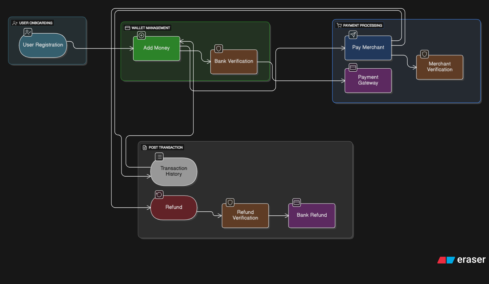

📱 Digital Wallet Simulation
FinTech QA, UAT & Release Management Project
⚡ This project demonstrates end-to-end ownership of a fintech product lifecycle, not just testing.

   

🚀 Overview

This project simulates a real-world digital wallet system and demonstrates how a product moves from idea → development → testing → release.

The workflow covered:

User Registration → Add Money → Pay Merchant → Refund → Notifications

Unlike typical QA projects, this focuses on complete product lifecycle ownership, including:

Product thinking (user stories)
Agile sprint planning
QA testing & defect tracking
Regression validation
UAT & release sign-off

🎯 Objectives
Simulate a FinTech product lifecycle
Apply QA + UAT best practices
Understand release management workflows
Build a product + QA hybrid mindset

🧭 Workflow Diagram

 

📌 User Stories (Jira)

Created 7 user stories with acceptance criteria:

Core Features
User Registration (Mobile + OTP)
Valid OTP → success, invalid OTP → error
Add Money (UPI/Card)
Balance updates after successful transaction
Pay Merchant (QR/UPI)
Payment reflected in transaction history

Enhancements
Transaction History
Displays amount, date, merchant
Refund Processing
Refund updates balance + history
Notifications (SMS/Email)
Alerts sent for every transaction

📊 Jira Execution (Backlog + Board)
Created backlog and organized work into sprints
Tracked progress using To Do → In Progress → Done

🗂️ Sprint & Release Planning
🟢 Sprint 1 (Core → Release v1.0)
User Registration
Add Money
Pay Merchant
🔵 Sprint 2 (Enhancements → Release v1.1)
Transaction History
Refunds
Notifications
📦 Release Strategy
v1.0 → Core wallet features
v1.1 → Enhancements + bug fixes

Also defined:

Dependencies (e.g., payment APIs, SMS services)
Rollback plans for each feature

🧪 QA & Testing
✔ Manual Testing

Designed structured test cases covering:

Positive scenarios
Negative scenarios
Edge cases
📄 Test Case Format

| Test Case ID | Feature | Steps | Expected Result | Actual Result | Status |

🐞 Defect Management

Maintained a defect log with:

| Defect ID | Feature | Description | Severity | Status |

Focused on:

Severity-based prioritization
Clear reproduction steps
Tracking bug lifecycle

🔁 Regression Testing
📌 What is it?

Whenever a new feature is added (like Refund), we verify that existing features still work correctly.

✅ Example Checks:
Login works after refund module
Add money updates balance correctly
History reflects payments + refunds

👉 Ensures system stability after every release

🧑‍💼 UAT (User Acceptance Testing)

Conducted a mock UAT cycle with stakeholder perspective to simulate real-world release approval.

Included:

End-to-end user journey validation
Business scenario testing
Feedback-based improvements

📄 Output: UAT Report

🔄 QA Workflow Followed
Requirement understanding
User story creation (Jira)
Sprint planning
Test case design
Test execution
Defect logging
Regression testing
UAT validation
Release sign-off

digital-wallet-qa-uat-simulation/
│
├── README.md
├── assets/
│   └── workflow.png
│
├── docs/
│   └── UAT_Report.docx
│
├── test-artifacts/
│   ├── TestCases.xlsx
│   ├── DefectLog.xlsx
│   ├── Regression_Checklist.xlsx
│
├── jira/
│   └── user-stories.md

🧠 Key Learnings
QA is not just testing—it’s ensuring product reliability
Writing clear user stories improves testing clarity
Bugs should be prioritized based on user impact
Regression testing is critical for stable releases
UAT ensures the product is business-ready, not just technically correct

🎯 Outcome
Built a realistic fintech QA & release simulation
Demonstrated:
End-to-end ownership
Structured thinking
Product + QA collaboration

🔮 Future Improvements
Add API testing
Integrate CI/CD pipeline
Expand into fraud detection scenarios

